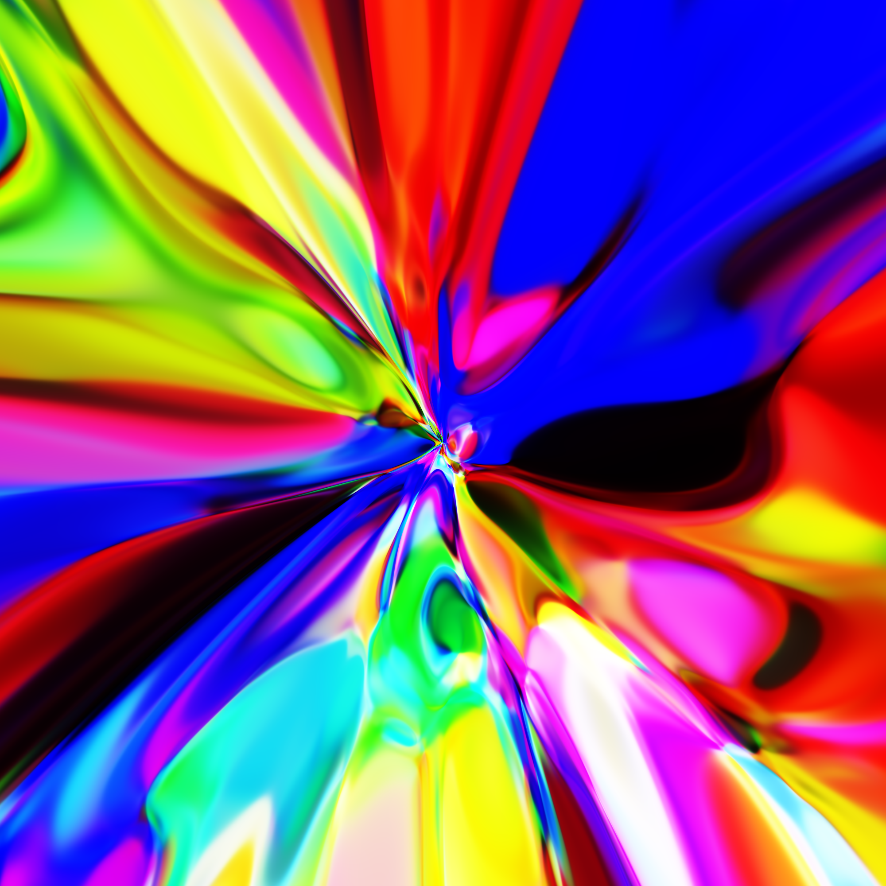
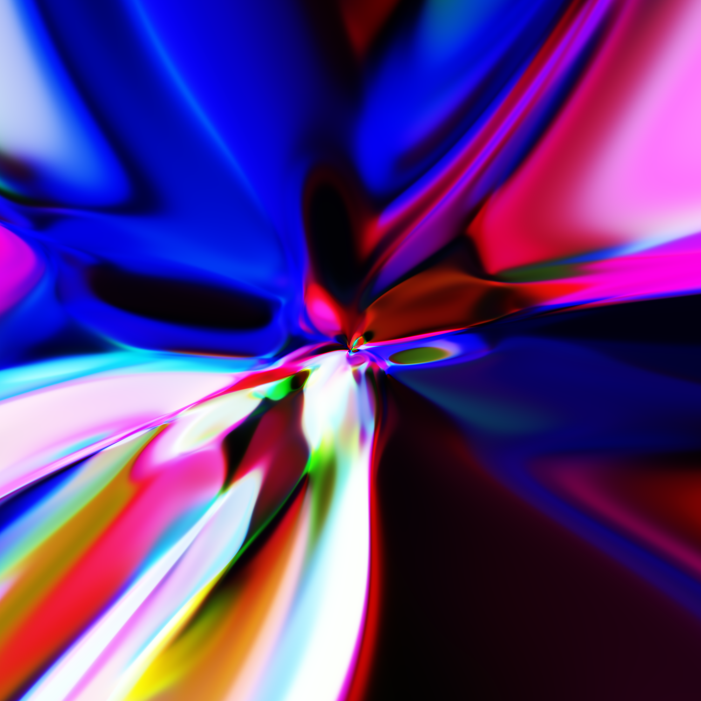
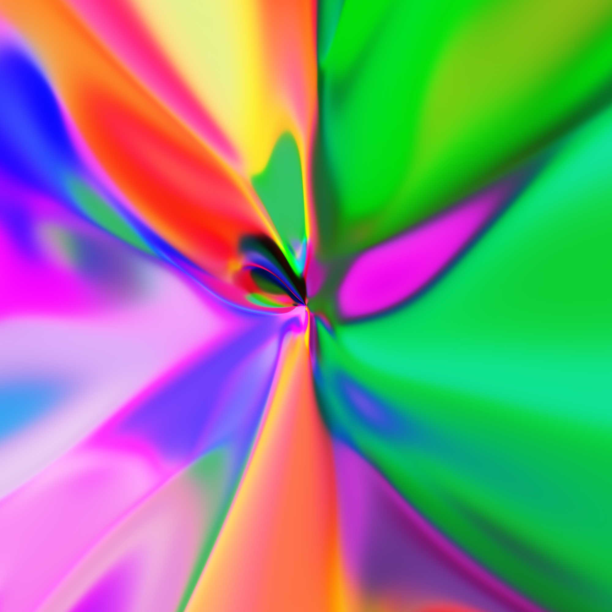
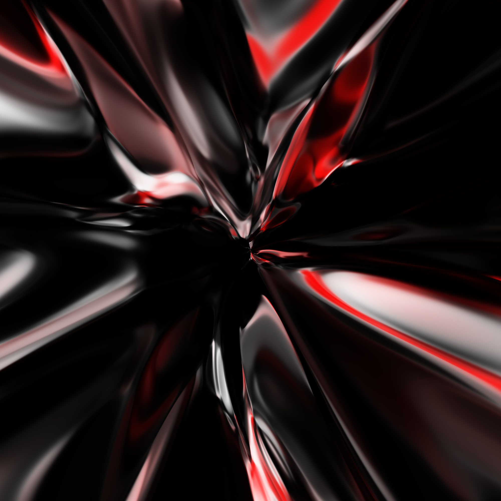

# neural-network-paint

Generating abstract patterns with a feed forward neural network

<center>  </center>

```
(x, y) : image coordinates
r      : sqrt(x² + y²)
c      : color (rgb)
```

Results:
https://github.com/smdaa/neural-network-paint/blob/main/video.mp4

High-res renders:
<center>  </center>
<center>  </center>
<center>  </center>
<center>  </center>
<center>  </center>
